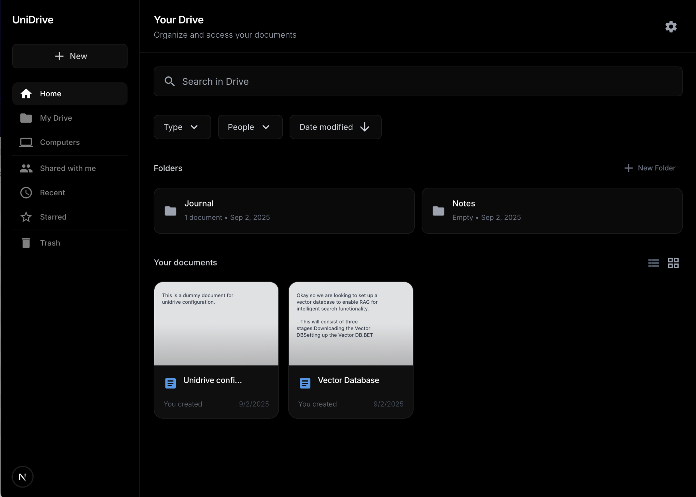

# UniDrive

> **A private Google Drive alternative you run on your own machine.** A Next.js app with rich document editing powered by [Univer](https://github.com/dream-num/univer).



Self-hosted document management with Google Docs-like editing, file system storage, and document previews. Create, edit, and organize your documents locally with professional-grade rich text editing.

---

## ✨ Why UniDrive

- **Own your data** – Runs entirely on your computer. No third-party cloud services.
- **Rich editing** – Google Docs-style editor with real-time auto-save via Univer.
- **Document previews** – Visual previews of your documents in the file browser.
- **Local-first** – All files stored locally in your file system with JSON-based document format.
- **Professional UI** – Clean, responsive interface with dark theme and search functionality.
- **Simple setup** – Just Node.js required. No complex server setup or databases.

> Perfect for anyone who wants document management and editing without relying on cloud services.

---

## 🚀 Quick start

### Prerequisites
- **Node.js 18+** (LTS) and **npm**
- macOS, Linux, or Windows

### 1) Clone & install
```bash
git clone https://github.com/abrar360/unidrive
cd unidrive
npm install
```

### 2) Run development server
```bash
npm run dev
# Open http://localhost:3000
```

### 3) Build & run (production)
```bash
npm run build
npm run start
```

That's it! No configuration files or environment variables needed. UniDrive works out of the box with local file storage in the `storage/` directory.

---

## 🧭 Features

- **Document browser** with visual previews showing actual content
- **Rich text editor** powered by Univer with Google Docs-like functionality
- **Auto-save** with real-time status indicators ("Editing...", "Saving...", timestamps)
- **Search & sort** documents by name, creation date, modification date, or size
- **Context menus** for rename, duplicate, and delete operations
- **Folder organization** to group related documents
- **Dark theme** responsive UI optimized for desktop use
- **File system storage** with human-readable JSON document format

> Built with Next.js 14, TypeScript, and Tailwind CSS.

---

## 🔐 Security & privacy

- **Local-only** – All documents stored on your machine in the `storage/` directory
- **No telemetry** – No data sent to external servers or analytics services
- **File system based** – Documents stored as standard JSON files you can backup and inspect
- **Self-hosted** – You control your data and who has access

> For network access, use a reverse proxy with proper authentication or tools like Tailscale for secure remote access.

---

## 🛠️ Configuration

UniDrive works out of the box with no configuration required. For customization:

### Storage Location
Documents are stored in `./storage/` with the following structure:
- `storage/documents/` - Document content as JSON files
- `storage/metadata/` - Document metadata (title, dates, size)
- `storage/previews/` - Generated SVG previews of documents
- `storage/folders/` - Folder organization data

### Port Configuration
To run on a different port:
```bash
# Development
npm run dev -- -p 3001

# Production
npm run start -- -p 3001
```

### Backup
Simply backup the entire `storage/` directory to preserve all your documents and metadata.

---

## 🧪 Development

```bash
# Clone the repository
git clone https://github.com/abrar360/unidrive
cd unidrive

# Install dependencies
npm install

# Start development server
npm run dev   # http://localhost:3000

# Build for production
npm run build
npm run start

# Run linting
npm run lint
```

### Architecture
- **Frontend**: Next.js 14 with App Router, TypeScript, Tailwind CSS
- **Editor**: Univer rich text editor with facade API for document manipulation
- **Storage**: File system based with JSON document format
- **API**: REST endpoints built with Next.js API routes

---

## 🤝 Contributing

Issues and pull requests are welcome! Please feel free to:
- Report bugs or request features via GitHub Issues
- Submit PRs for improvements or bug fixes
- Share feedback on the user experience

---

## 📄 License

MIT License - see [LICENSE](./LICENSE) file for details.

---

## 🙏 Acknowledgements

- **[Univer](https://github.com/dream-num/univer)** - Powerful rich text editor that makes the Google Docs-like experience possible
- **Next.js team** - For the excellent React framework and developer experience
- **Tailwind CSS** - For the utility-first CSS framework

---

> **UniDrive** — Self-hosted document management with rich text editing. A Next.js app that gives you Google Drive functionality without the cloud dependencies.

